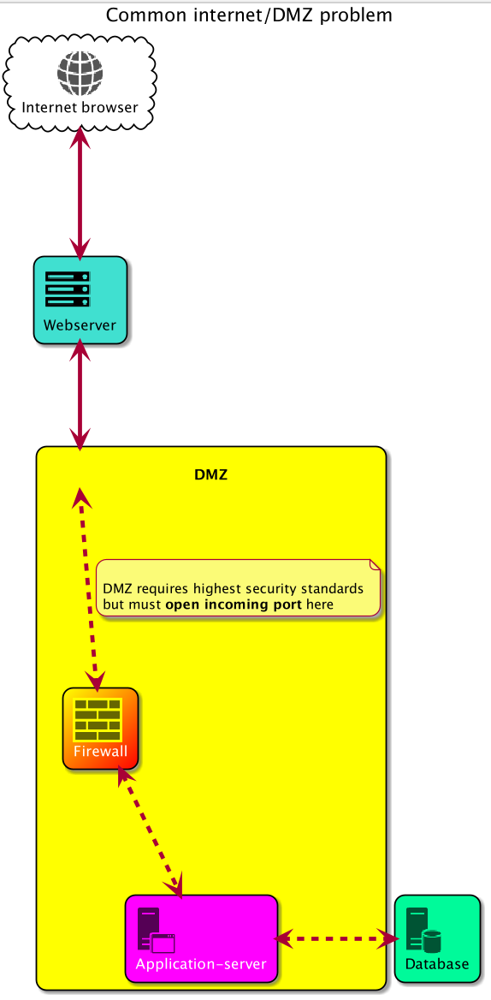
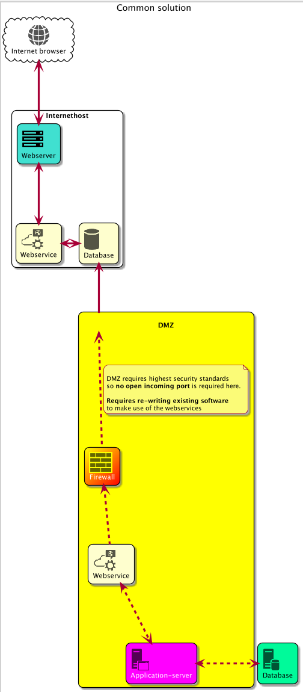
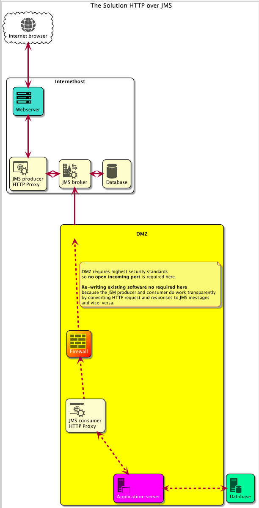

# HTTP2JMS Proxy

This project is proof of concept that addresses a common challenge in the communication  
between the **DMZ** and **internet webserver**

### The problem
Internet applications in general have an application server or a database running in background    
to which they have an open connection to.   

Since the database holds sensitive data like user accounts, credentials or payment data,   
it is mostly installed not on the internet server directly but on a machine behind the **DMZ**.   

This szenario requires to have open ports on the DMZ so the internet server can open a connection to the database.    
Due to security concerns it is not wanted at all to have open incoming ports on a DMZ machine.  




### The common solution

To circumvent open ports to the **DMZ** machine most internet application and the application inside the application server will be rewritten to use a webservice.  
All requests to the internet application will be sent to the webservice which will write them into a database on the internet server.    
The application server on the DMZ has to poll against this webservice (or its database) to check for new request to be processed.    

In this szenario no incoming open ports on the DMZ machine are required.   

The whole process the internet application has to wait (polling against a webservice) until  
the request has being processed and it can receive its response.  


 

### The HTTP over JMS solution

This solution solves this problem by converting HTTP request and responses into JMS Message and vice-versa.    
It works transparently so no software re-writing is required.  
It makes use of a JMS broker, which can be freely configured or even exchanged by another JMS standard compliant one.  

This is how it works:

The JMS producer will be installed instead of the webapplication at the same url path of the webapplication.  
Every HTTP request will be sent to the JSM Producer will be converted to a JMS message and sent to the JMS broker.   

The JMS consumer will be installed into the DMZ and does register itself to the JMS broker when started    
and will be notified by the JMS consumer for every HTTP Request by receiving a JMS message  
which will be then converted back to an HTTP request and will be then sent to the target application server.  

The way back works just the same:  

The JMS consumer will receive the HTTP response from the application server and convert it to a JMS message  
and send it to the JMS broker.  
The JMS broker will then notify the JMS producer and send him the JMS message which the JMS producer will   
then convert to HTTP response and send to the webclient or browser.

 

 




## Build

Must be build with Java 8.

CD into project directory and run this build command

```
     $ export JAVA_HOME="/Library/Java/JavaVirtualMachines/jdk1.8.0_151.jdk/Contents/Home";\
       mvn clean package
```
This will produce a directory `dist` containing also a `README.MD` file explaining how to install.

## Docker
  
After building the distribution directory `dist` by the build step above
you may want to create a Docker image and run all components in separate Docker Container.
 
To do so head over to [DOCKER.MD](DOCKER.MD)


## Configuration and FAQs
  
- Get some [detailed configuration explanation here](./CONFIGURATION.MD)

- Read about some [known issues here](./FAQ.MD)
